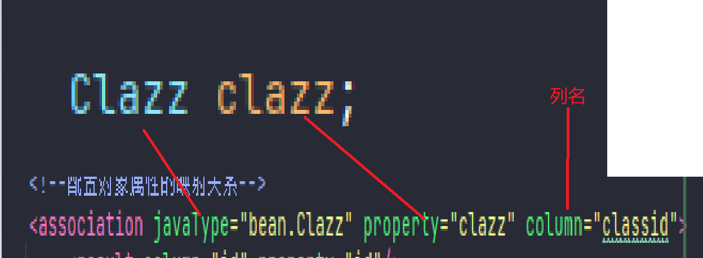
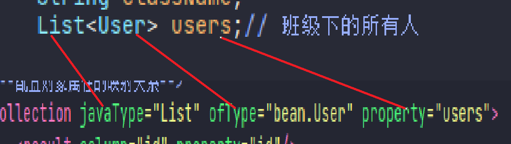

两张表的关联查询

1. 多对一的UserMapper.xml配置，使用association
    ```xml
   <resultMap id="UserMap" type="bean.User">
        <result column="id" property="id"/>
        <result column="u_name" property="name"/>
        <result column="u_passwd" property="passwd"/>
        <result column="email" property="email"/>
        <result column="birth" property="birth"/>

        <!--配置对象属性的映射关系-->
        <association javaType="bean.Clazz" property="clazz" column="classid">
            <result column="id" property="id"/>
            <result column="name" property="className"/>
        </association>
    </resultMap>
    ```
    - association用来配置另一张关联表的列属映射
    - javaType：指定对象属性的全限定类名
    - property：对象属性的属性名称
    - column：数据库中外键列名
    - 然后在里面配置属于被关联表的列属映射
   
   这样是不是更好记
   
2. 一对多的ClazzMapper.xml，使用collection
   ```xml
   <resultMap id="ClazzMap" type="bean.Clazz">
        <result column="id" property="id"/>
        <result column="name" property="className"/>

        <!--配置对象属性的映射关系-->
        <collection javaType="List" ofType="bean.User" property="users">
            <result column="id" property="id"/>
            <result column="u_name" property="name"/>
            <result column="u_passwd" property="passwd"/>
            <result column="email" property="email"/>
            <result column="birth" property="birth"/>
        </collection>
    </resultMap>
   ```
    - collection用来配置集合属性的映射
    - javaType：集合属性的type
    - property：集合属性的属性名
    - ofType：集合属性的泛型
    - 然后在里面配置被关联表的列属映射

   这样是不是更好记
   
